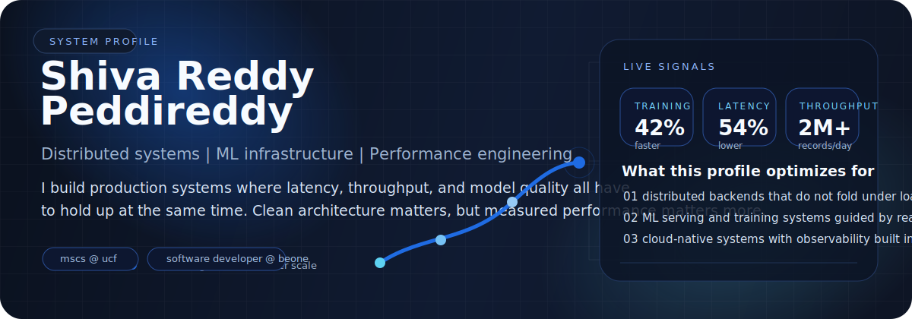
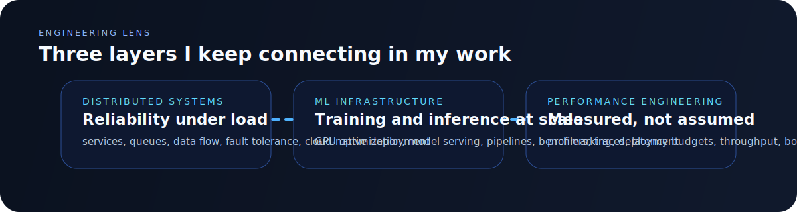

<a href="https://github.com/shivareddy42">
  
</a>

<h1 align="center">I engineer systems that still feel fast when the workload stops being friendly.</h1>

<p align="center">
  
</p>

<p align="center">
  Software Developer @ BeOne Medicines | Graduate TA @ UCF | Former Software Engineer @ Baantics Solutions
</p>

<p align="center">
  <a href="https://www.linkedin.com/in/shivareddy42"></a>
  <a href="mailto:shivareddy761005@gmail.com"></a>
  <a href="https://shivareddy42.github.io"></a>
  
</p>



## whoami.yaml

```yaml
name: Shiva Reddy Peddireddy
focus:
  - distributed systems
  - ML infrastructure
  - performance engineering
current:
  - Software Developer @ BeOne Medicines
  - Graduate TA @ UCF
previous: Software Engineer @ Baantics Solutions
education: MS Computer Science @ UCF, 4.0 GPA, May 2026
```

I work where distributed systems, ML infrastructure, and performance engineering overlap. The problems I enjoy most are the ones where a small regression becomes a very visible production problem and the only honest answer is to measure, trace, benchmark, and fix it properly.

At Baantics, I cut PyTorch training time by **42%**, reduced inference latency by **54%**, and helped deliver a pipeline that processed **2M+ records per day**. Right now I am building enterprise integration systems at **BeOne Medicines** while finishing my **MS in Computer Science at UCF**.

## Proof, Not Buzzwords

<table>
  <tr>
    <td valign="top" width="33%">
      <h3>Impact</h3>
      <p><b>42%</b> faster training</p>
      <p><b>54%</b> lower inference latency</p>
      <p><b>2M+</b> records processed daily</p>
      <p><b>4.0 GPA</b> in MS Computer Science</p>
    </td>
    <td valign="top" width="33%">
      <h3>I optimize for</h3>
      <p>Latency-sensitive backends</p>
      <p>Reliable ML pipelines</p>
      <p>Cloud-native deployment</p>
      <p>Observability from day one</p>
    </td>
    <td valign="top" width="33%">
      <h3>My default approach</h3>
      <p>Measure before tuning</p>
      <p>Fix bottlenecks at the real choke point</p>
      <p>Keep systems elegant under pressure</p>
      <p>Build with scale in mind early</p>
    </td>
  </tr>
</table>



## Featured Systems

<p>
  These are the projects that best reflect how I think: practical, performance-aware, and designed for real workloads rather than demo-only conditions.
</p>

<table>
  <tr>
    <td width="50%">
      <a href="https://github.com/shivareddy42/inference-server">
        
      </a>
    </td>
    <td width="50%">
      <a href="https://github.com/shivareddy42/ml-training-profiler">
        
      </a>
    </td>
  </tr>
  <tr>
    <td width="50%">
      <a href="https://github.com/shivareddy42/distributed-ids">
        
      </a>
    </td>
    <td width="50%">
      <a href="https://github.com/shivareddy42/dreamforge">
        
      </a>
    </td>
  </tr>
</table>

## Core Stack

<p align="center">
  
</p>

<details>
<summary><b>Currently building and exploring</b></summary>
<br />

```text
- enterprise integration systems at BeOne Medicines
- inference optimization and ML systems work
- distributed systems design and cloud-native architecture
- profiler-driven performance engineering
```

</details>

## Live Telemetry

<table>
  <tr>
    <td width="50%">
      
    </td>
    <td width="50%">
      
    </td>
  </tr>
</table>

<div align="center">
  
</div>

## Contribution Snake

<div align="center">
  <picture>
    <source media="(prefers-color-scheme: dark)" srcset="https://raw.githubusercontent.com/shivareddy42/shivareddy42/output/github-snake-dark.svg" />
    <source media="(prefers-color-scheme: light)" srcset="https://raw.githubusercontent.com/shivareddy42/shivareddy42/output/github-snake.svg" />
    
  </picture>
</div>

<p align="center">
  <i>If it is distributed, latency-sensitive, GPU-heavy, or hard to debug, I am probably interested.</i>
</p>

<a href="https://github.com/shivareddy42">
  
</a>
