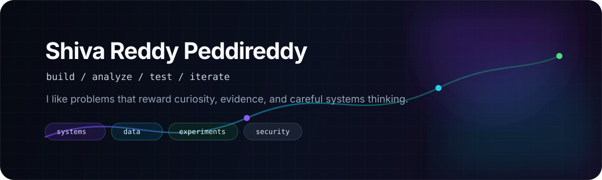

<div align="center">



<br/>

<a href="https://shivareddy42.github.io"></a>
<a href="https://github.com/shivareddy42?tab=repositories"></a>

</div>

<br/>

<table>
<tr>
<td width="58%" valign="top">

### What this profile is

A collection of things I have built to answer questions I found interesting.

Some are systems. Some are experiments. Some are analyses. Some are deliberately weird. The common thread is that I like taking vague problems, making them measurable, and turning the result into something you can inspect, run, or challenge.

</td>
<td width="42%" valign="top">

### How I tend to work

```text
question → model → build → measure
                 ↑         ↓
              revise ← evidence
```

**Prefer evidence over assumptions.**  
**Design for failure, not just success.**  
**Make complexity legible.**

</td>
</tr>
</table>

<br/>

## Featured work

### 01 · TRUSTFALL · when systems compose, risk composes too

<a href="https://github.com/shivareddy42/trustfall-poc">
  
</a>

<table>
<tr>
<td width="72%" valign="top">

An adversarial benchmark for studying what happens when autonomous agents operate across multiple connected systems instead of a single isolated tool surface. It models approval chains, shared state, cascades, scope boundaries, and structured-field attacks.

The interesting part is not just whether something fails, but **how far the failure propagates, whether it can be reversed, how quickly it is detected, and whether effective privilege exceeds declared privilege**.

[**Explore the repository →**](https://github.com/shivareddy42/trustfall-poc) &nbsp; · &nbsp; [Live dashboard](https://shivareddy42.github.io/trustfall-poc/Landing.html) &nbsp; · &nbsp; [Findings](https://github.com/shivareddy42/trustfall-poc/blob/main/report/findings.md)

</td>
<td width="28%" valign="top">

**30** adversarial scenarios  
**4** evaluated models  
**3** connected simulators  
**22** tool endpoints  
**1.43×** mean transitive privilege ratio  
**$62K** forged-authority failure

</td>
</tr>
</table>

<br/>

### 02 · Flyway Surfer · a tiny fly, a giant swatter, and 26,544 edges

<table>
<tr>
<td width="52%" valign="top">

**[Play it in the browser →](https://flyway-surfer.lightningshiva1.chatgpt.site)**

A 3D endless runner where the player can hand control to an experimental circuit pilot derived from a real-connectivity subset of a fruit-fly nervous system.

The project mixes game design, deterministic simulation, graph dynamics, rendering, controls, testing, and an intentionally transparent model explanation. Manual play and the circuit pilot can be swapped during a run.

[Source](https://github.com/shivareddy42/flyway-surfer)

</td>
<td width="48%" valign="top">

```text
1,072 neurons
26,544 directed edges
3 lanes
2 control modes
0 remote inference calls
```

The controller receives game observations, stimulates selected sensory neurons, propagates activity through a fixed graph, and decodes descending-neuron activity into steering decisions.

</td>
</tr>
</table>

<br/>

### 03 · Systems that have to perform

<table>
<tr>
<td width="50%" valign="top">

#### [Mirage](https://github.com/shivareddy42/mirage)

**7.2× faster than the naive baseline** for a text-to-video generation pipeline.

Scene planning → batched keyframe generation → interpolation → FFmpeg assembly, with mixed precision, compiled execution, Redis-backed jobs, and a browser interface.

`CUDA` · `PyTorch` · `Redis` · `FFmpeg` · `Docker`

</td>
<td width="50%" valign="top">

#### [Inference Server](https://github.com/shivareddy42/inference-server)

A low-latency serving stack built around dynamic batching and multiple runtimes.

The included benchmark reaches **2,847 req/s** on the documented dummy-model test while exposing P50/P95/P99 latency, health data, deployment manifests, and load tooling.

`FastAPI` · `ONNX` · `TensorRT` · `Kubernetes` · `Docker`

</td>
</tr>
</table>

<br/>

### 04 · Analysis where the answer can be “the hypothesis was wrong”

<table>
<tr>
<td width="56%" valign="top">

<a href="https://github.com/shivareddy42/ipl-rest-day-effect">
  
</a>

</td>
<td width="44%" valign="top">

#### [IPL Rest Day Effect](https://github.com/shivareddy42/ipl-rest-day-effect)

I tested a simple intuition: if a team gets more time to recover and prepare, does it win more often?

Across **878 unequal-rest matches**, the more-rested team won **52.3%** of the time. The result was not statistically significant. At a gap of three or more days, the effect disappeared entirely.

That is the kind of result I like: clear question, reproducible method, and no need to force the data into the original story.

</td>
</tr>
</table>

<br/>

### 05 · Different problem, different tool

<table>
<tr>
<td width="50%" valign="top">

#### [ER Operations Simulation](https://github.com/shivareddy42/ER-Simulation-Analysis-RL)

Discrete-event simulation for emergency-room operations with an optimization layer that can recommend staffing configurations and compare system behavior under changing resource constraints.

`SimPy` · `PPO` · `Streamlit` · `Plotly`

</td>
<td width="50%" valign="top">

#### [Crypto Strategy Arena](https://github.com/shivareddy42/crypto-strategy-arena)

A browser-based strategy simulator where five algorithms consume live BTC/USD data, manage independent simulated portfolios, and compete on PnL, win rate, and Sharpe ratio.

[Live arena →](https://shivareddy42.github.io/crypto-strategy-arena/)

</td>
</tr>
</table>

<br/>

<details>
<summary><b>More things I have explored</b></summary>

<br/>

There are also smaller experiments across generative interfaces, distributed intrusion detection, web apps, simulation, algorithms, and earlier learning projects. I keep them public because a GitHub profile is more useful when it shows progression instead of pretending every repository was born polished.

→ [Browse everything](https://github.com/shivareddy42?tab=repositories)

</details>

<br/>

## Toolbox

<div align="center">


</div>

<br/>

## Activity

<div align="center">

<picture>
  <source media="(prefers-color-scheme: dark)" srcset="./assets/github-snake-dark.svg" />
  <source media="(prefers-color-scheme: light)" srcset="./assets/github-snake.svg" />
  
</picture>

<br/><br/>

<a href="https://github.com/shivareddy42?tab=overview&from=2026-01-01&to=2026-12-31">View contribution activity on GitHub →</a>

<br/><br/>

<sub>Curiosity is the through-line. The tools change with the problem.</sub>

</div>
